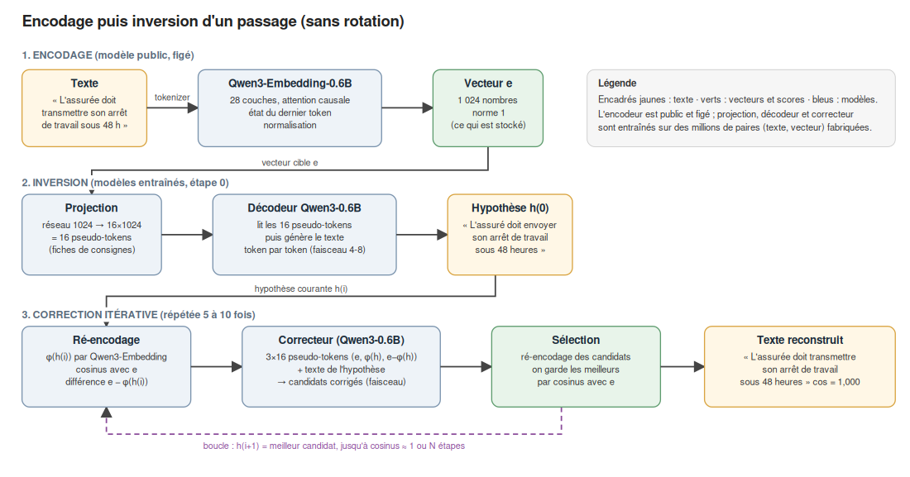
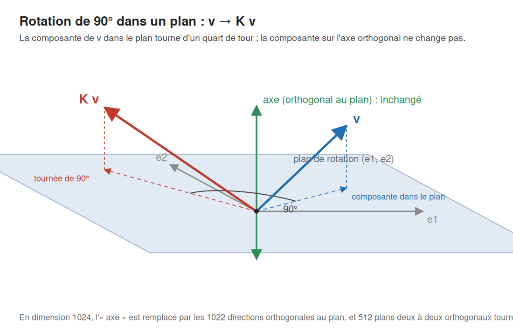

# Inversion d'embeddings et protection des vecteurs d'un RAG de santé

*Version de travail, 5 octobre 2026. Document destiné aux équipes sécurité et aux chercheurs. Expériences réalisées
sur la machine décrite au chapitre 9 ; modèles et scripts dans ce dépôt. Un glossaire figure au chapitre 10.*

## 1. Contexte

Un système de RAG (recherche augmentée par génération) indexe des documents sous forme de **vecteurs
d'embeddings** : chaque passage de texte est transformé par un modèle d'encodage en un vecteur de nombres
(ici 1 024 valeurs, modèle `Qwen/Qwen3-Embedding-0.6B`), et la recherche consiste à trouver les vecteurs les
plus proches de celui de la question. Ces vecteurs ont longtemps été considérés comme une représentation
opaque, sans valeur pour qui ne dispose pas des textes. Ce n'est pas le cas : un vecteur contient assez
d'information pour que l'on puisse **reconstruire le texte**, exactement pour une phrase courte, en paraphrase
fidèle pour un paragraphe.

Ce document décrit deux choses :

1. la construction d'un **inverseur** pour Qwen3-Embedding-0.6B en français, et ce qu'il retrouve ;
2. la protection des vecteurs d'une base de santé par **dé-identification** des textes puis **rotation
   secrète** des vecteurs, et la valeur de cette protection face aux attaques connues.

## 2. Travaux antérieurs et apport

### 2.1 Inversion d'embeddings : la méthode vec2text

La technique d'inversion mise en œuvre ici est celle décrite par Morris, Kuleshov, Shmatikov et Rush dans
*Text Embeddings Reveal (Almost) As Much As Text* (EMNLP 2023, arXiv:2310.06816), connue sous le nom de
**vec2text** : un modèle génératif est entraîné à produire le texte à partir de son vecteur, puis un second
modèle, le correcteur, affine itérativement l'hypothèse en comparant le vecteur du texte proposé au vecteur
cible. Les auteurs montrent qu'avec cinquante étapes de correction et une recherche en faisceau, des phrases
de 32 tokens encodées par GTR (un encodeur dérivé de T5, 768 dimensions) sont reconstruites exactement dans
92 % des cas (BLEU 97,3). Nous n'apportons pas de méthode nouvelle : nous avons **repris cette technique** et
l'avons appliquée à un encodeur récent et au français, avec des choix d'ingénierie propres (décodeur de type
GPT au lieu de T5, tokenizer commun à l'encodeur et au décodeur, constitution des corpus) détaillés au
chapitre 4.

L'injection d'un vecteur dans un modèle de langage sous forme d'une séquence de **pseudo-tokens** (4.3) est
elle-même antérieure : vec2text la reprend de ClipCap (Mokady, Hertz et Bermano, 2021), où le vecteur CLIP
d'une image est projeté en un préfixe de 10 à 40 embeddings placé devant GPT-2 pour produire une légende.
Elle s'inscrit dans la lignée du *prefix tuning* (Li et Liang, 2021) et du *prompt tuning* (Lester, Al-Rfou et
Constant, 2021), qui pilotent un modèle gelé par des tokens virtuels appris, et des modèles multimodaux
(Frozen, Flamingo, BLIP-2, LLaVA) qui convertissent une entrée non textuelle en pseudo-tokens. L'idée d'un
unique pseudo-token remonte aux premiers modèles de légendes d'images (Vinyals et al., *Show and Tell*, 2015).

### 2.2 Transformations conservant les distances

L'idée de protéger des données par une **rotation aléatoire secrète**, qui conserve distances et produits
scalaires et laisse donc intacts les algorithmes de recherche ou de classification, est ancienne :

- en fouille de données, la *rotation perturbation* de Chen et Liu (2005 ; *Knowledge and Information Systems*,
  2010) ;
- en recherche de plus proches voisins sur bases externalisées, le schéma ASPE de Wong, Cheung, Kao et Mamoulis
  (*Secure kNN computation on encrypted databases*, SIGMOD 2009), où documents et requêtes sont multipliés par une
  matrice secrète et son inverse.

Ses limites sont tout aussi anciennes. Liu, Giannella et Kargupta (*An attacker's view of distance preserving
maps for privacy preserving data mining*, PKDD 2006, puis IEEE TKDE) montrent que toute transformation
conservant exactement les distances cède à deux attaques : à **paires connues** (l'attaquant connaît quelques
données en clair et leur image, et retrouve la matrice par moindres carrés orthogonaux, le problème de
Procrustes) et à **échantillon connu** (l'attaquant connaît la distribution des données et aligne les nuages).
ASPE est de même vulnérable aux attaques à texte clair connu ou choisi (Yao, Li et Xiao, *Secure nearest
neighbor revisited*, ICDE 2013). Pour les embeddings de texte, les travaux récents confirment la vulnérabilité
d'une rotation globale secrète à Procrustes dès que l'attaquant dispose d'un nombre de paires de l'ordre de la
dimension (ConjFormer, *Privacy from Symmetry: Orthogonally Equivariant Transformers*, 2026), proposent des
défenses par bruit calibré (TextCrafter, 2025) et décrivent des attaques d'inversion à peu d'exemples (ALGEN,
ACL 2025) ou transférables (*Transferable Embedding Inversion Attack*, ACL 2024). Les références complètes sont
données au chapitre 11.

### 2.3 Apport de ce travail

Ce travail ne propose pas de primitive cryptographique nouvelle. Il apporte des **mesures** et une **règle
d'emploi**, obtenues en construisant l'attaque pour l'évaluer sur un encodeur et un inverseur actuels :

- la quantification, sur Qwen3-Embedding-0.6B et un inverseur entraîné à cet effet, de ce qu'un vecteur révèle
  selon la longueur du texte (reconstruction exacte à 32 tokens, paraphrase à 128), et de l'angle de rotation
  nécessaire pour aveugler l'inverseur, avec son explication géométrique (la perturbation d'une rotation modérée
  tombe presque entièrement hors du sous-espace porteur de sens) ;
- la comparaison expérimentale de variantes de clés (permutation des coordonnées, plans choisis selon les
  composantes principales, angles fixes ou aléatoires), chacune évaluée par l'attaque qui la casse ;
- le choix d'une **rotation d'angle fixe de 90° dans 512 plans tirés au hasard**, dont la clé est le choix des
  plans, dérivée par usager à partir d'une clé maître, avec la démonstration de son équivalence, en sécurité,
  avec une rotation uniformément aléatoire ;
- une règle de dimensionnement des clés (nombre maximal de vecteurs par clé, selon le type de document) fondée
  sur une simulation de l'attaque par paires connues enchaînée à l'inverseur, reproductible pour recalibrer le
  seuil quand les inverseurs progressent ;
- des exemples sur des textes synthétiques de parcours de soins, avant et après dé-identification, qui montrent
  concrètement ce qui fuit ;
- une observation sur l'entraînement du correcteur : ses hypothèses d'entraînement doivent être produites par
  l'inverseur **sur des passages que celui-ci n'a jamais vus**. L'article vec2text génère ces hypothèses sur le
  jeu d'entraînement de l'inverseur sans discuter ce point (section 3.2 et figure 4) ; dans notre configuration,
  où l'inverseur a mémorisé son corpus, un correcteur entraîné sur ces hypothèses trop bonnes apprend à ne
  presque rien corriger (BLEU 48,7 contre 62,8 à 5 étapes). C'est le principe des prédictions hors pli
  (*out-of-fold*) appliqué à la chaîne inverseur → correcteur (voir 4.5).

## 3. Fuite d'information par les vecteurs

Le modèle d'encodage est une fonction `φ : texte → vecteur`. Elle n'est pas inversible au sens mathématique,
mais elle est apprise et régulière : deux textes proches donnent des vecteurs proches, et 1 024 nombres réels
représentent beaucoup d'information. Pour une phrase de 20 à 25 mots (32 tokens), c'est assez pour la
déterminer presque entièrement ; pour un paragraphe de 128 tokens, le vecteur ne retient que le sujet, les
entités saillantes et le registre.

Puisque `φ` est accessible, on fabrique soi-même des millions de paires (texte, φ(texte)) et l'on entraîne un
second modèle `ψ : vecteur → texte` qui approxime l'inverse. Aucune donnée annotée, aucun accès privilégié : il
suffit du modèle d'encodage, public, et de textes quelconques dans la langue visée.

## 4. Construction de l'inverseur



*Figure 1. Chaîne d'encodage et d'inversion, sans rotation. L'encodeur (en haut) est le modèle public ; la
projection, le décodeur et le correcteur sont les modèles entraînés ici.*

### 4.1 Choix du couple encodeur / décodeur

L'inverseur est un modèle de langage génératif. Nous avons choisi `Qwen/Qwen3-0.6B-Base` parce qu'il partage
exactement le tokenizer de l'encodeur Qwen3-Embedding-0.6B (151 669 tokens identiques) : le décodeur écrit dans
l'alphabet même dont l'encodeur est issu, et il sait déjà écrire le français. L'encodeur est lui aussi un
transformeur (28 couches, 16 têtes d'attention) ; il ne diffère d'un modèle génératif que par sa sortie, l'état
du dernier token normalisé au lieu d'une prédiction de token.

Autres pistes examinées : `mistral-embed` (API seule, pas de poids, écarté), Granite-Embedding-311M-R2, bge-m3,
multilingual-e5 (sans générateur au même tokenizer), et un décodeur plus gros (Qwen3-1.7B, voir 4.8).

### 4.2 Données d'entraînement

- Textes : Wikipédia FR et FineWeb-2 FR (pages web françaises), découpés en passages aléatoires coupés sur des
  frontières de mots. Deux corpus : passages de 4 à 32 tokens (3,0 M, puis 2,9 M + 333 k passages du domaine
  santé / sécurité sociale) et passages de 16 à 128 tokens (600 k).
- Corpus du domaine : filtrage par mots-clés (assurance maladie, cotisations, arrêt de travail, médecin,
  traitement, vaccin, etc.) sur 8 M de documents, 360 k passages retenus, plus des jeux de test du domaine.
- Vecteurs : chaque passage encodé par Qwen3-Embedding-0.6B en mode document (sans instruction), normalisé,
  stocké en float16.

### 4.3 Architecture : injection du vecteur par pseudo-tokens

Un modèle de langage ne lit pas des mots mais des vecteurs : chaque token est remplacé par sa ligne dans une
table d'embeddings de tokens, et les couches d'attention ne voient que ces vecteurs. On peut donc injecter
directement des vecteurs dans la séquence d'entrée, sans qu'ils correspondent à aucun mot : ce sont les
pseudo-tokens.

Le vecteur à inverser (1 024 valeurs) passe dans un petit réseau (linéaire 1024→1024, GELU, linéaire
1024→n×1024, normalisation à l'échelle des vrais tokens) qui produit **n pseudo-tokens** (n = 8, puis 16)
placés en tête de la séquence. Le décodeur génère ensuite le texte token par token, exactement comme il
compléterait une phrase.

Analogie : les pseudo-tokens sont des fiches de consignes rédigées dans la langue intérieure du modèle ; le
petit réseau est le traducteur qui les écrit à partir du vecteur ; le décodeur a appris à lire les fiches avant
d'écrire.

**Pourquoi plusieurs pseudo-tokens et non un seul.** Un pseudo-token est une *position* de la séquence, et le
modèle lit les positions par l'attention, dont le débit par position est limité :

1. *Une position ne livre qu'un vecteur par couche.* Dans une couche d'attention, un token en cours de
   génération ne lit pas l'embedding d'une position précédente : il en récupère une **valeur** (un vecteur
   calculé par la couche), pondérée par un score d'attention. Avec un seul pseudo-token, tous les tokens
   générés, à toutes les couches, puisent dans la même valeur ; le préfixe est une mémoire à une case. Avec 8 ou
   16 pseudo-tokens, la mémoire a 8 ou 16 cases, que les têtes d'attention et les tokens générés consultent
   sélectivement (l'une porte le thème, une autre les nombres, une autre le registre, selon ce que l'entraînement
   trouve utile) : l'information devient adressable.
2. *Le préfixe est lui-même traité par le modèle.* Les pseudo-tokens traversent les 28 couches et s'attendent
   mutuellement : le préfixe forme un petit contexte que le modèle transforme avant de générer le premier mot,
   comme un mini-encodeur. Avec une seule position, il n'y a rien à combiner.
3. *Le vecteur de l'encodeur n'est pas écrit dans la langue du décodeur.* Que les deux dimensions valent 1 024
   est une coïncidence ; il faut une traduction apprise, et la projection vers n × 1 024 valeurs lui donne la
   place de déplier le vecteur en une représentation redondante que l'attention pré-entraînée sait lire.

vec2text utilise s = 16 pseudo-tokens et rapporte des gains décroissants au-delà ; la littérature du prompt
tuning observe la même saturation vers quelques dizaines de tokens virtuels. Ici, passer de 8 à 16 a fait partie
des changements de la v2 (avec plus d'époques et les données du domaine) qui ont porté le BLEU de l'inverseur
seul de 25,6 à 31,7 ; la contribution isolée de ce facteur n'a pas été mesurée. Le coût est négligeable
(8 ou 16 positions devant un texte de 32 à 128 tokens).

### 4.4 Entraînement de l'inverseur par descente de gradient

L'inverseur est entraîné comme n'importe quel modèle de langage, par descente de gradient stochastique ; seuls
le préfixe injecté et l'objectif diffèrent.

**Ce que l'on optimise.** Les paramètres ajustables sont tous les poids du décodeur (614 millions) et ceux de
la projection (quelques millions). Pour un passage t = (t₁, …, tₙ) de vecteur e, la perte est l'entropie
croisée

  L(θ) = − Σₖ log P_θ(tₖ | pseudo-tokens(e), t₁, …, tₖ₋₁),

c'est-à-dire l'opposé de la log-probabilité du texte vrai sachant le vecteur. On apprend en *teacher forcing* :
à chaque position, le modèle reçoit les vrais tokens précédents, pas ceux qu'il aurait générés, ce qui permet de
calculer les n prédictions d'un passage en un seul passage avant. Les logits ne sont calculés qu'aux positions
du texte, pas sur le préfixe.

**Une étape.** Lot de 128 passages (regroupés par longueur pour limiter le remplissage) ; passage avant
(projection, concaténation, 28 couches, logits) ; perte moyenne par token ; rétropropagation jusque dans la
projection, qui apprend ainsi à écrire des pseudo-tokens que les couches savent exploiter ; écrêtage de la norme
du gradient à 1 ; mise à jour par **AdamW** (β₁ = 0,9, β₂ = 0,98, décroissance de poids 0,01), avec un taux de
5·10⁻⁵ pour le décodeur (poids déjà bons, à ajuster doucement) et 5·10⁻⁴ pour la projection (poids aléatoires,
à apprendre vite), 300 pas d'échauffement puis décroissance en cosinus jusqu'à 5 % de la valeur initiale.

**À l'échelle.** Une époque sur 3 M de passages = 23 437 étapes ; l'inverseur v2 a fait 3 époques, soit 68 748
étapes et environ 9 millions d'exemples vus. Précision mixte (poids maîtres float32, calculs bfloat16),
`torch.compile` à formes fixes (gain ×1,9). Toutes les 1 000 à 2 000 étapes : perte sur un jeu de validation
jamais vu, et point de reprise (poids, état de l'optimiseur, numéro de pas).

**Versions.** v1 : 8 pseudo-tokens, 1 époque, perte de validation 1,235. v2 : 16 pseudo-tokens, 3 époques,
données du domaine, démarrage à chaud depuis v1, perte 1,223. La v2 mémorise déjà son corpus (perte
d'entraînement 0,61 contre 1,22 en validation ; l'époque 2 a apporté −0,14 en validation, l'époque 3 rien) :
des données nouvelles valent plus que des époques supplémentaires.

**Ce qui n'est pas de la descente de gradient.** L'encodeur est figé ; il ne sert qu'à fabriquer les vecteurs
et, à l'inférence, à ré-encoder les hypothèses. L'inférence elle-même (4.6) est une recherche discrète dans
l'espace des textes, sans gradient : on ne peut pas dériver par rapport à un mot. C'est le correcteur,
lui-même entraîné par descente de gradient, qui joue le rôle du pas vers la cible.

### 4.5 Correcteur itératif

**Rôle.** L'inverseur produit, à partir du vecteur cible e, une hypothèse h₀ : le bon sujet, souvent les bonnes
entités, mais des mots déplacés ou remplacés. On ne sait pas directement où est l'erreur, mais on peut la
mesurer : on ré-encode l'hypothèse, φ(h₀), et on la compare à e. Le cosinus dit à quel point on est loin ; la
différence e − φ(h₀) dit dans quelle direction de l'espace des embeddings aller. Le correcteur a appris à
traduire cette direction en modification du texte.

**Entrée et sortie.** C'est un second décodeur Qwen3-0.6B, de même architecture que l'inverseur, avec trois
projections au lieu d'une. Sa séquence d'entrée est

  [pseudo-tokens de e] [pseudo-tokens de φ(h)] [pseudo-tokens de e − φ(h)] tokens de h ⟨SEP⟩ → texte corrigé

soit 3 × 8 (ou 3 × 16) pseudo-tokens, le texte de l'hypothèse courante en clair, un séparateur, puis la version
corrigée générée token par token. Il voit à la fois la cible (sous forme de vecteur), ce qu'il a sous les yeux
(texte et vecteur de l'hypothèse) et l'écart entre les deux.

**Données d'entraînement.** On fait tourner l'inverseur (décodage glouton) sur des passages dont on connaît le
texte, ce qui donne des triplets (e, h₀, texte vrai), puis on ré-encode chaque h₀. Point décisif : ces passages
doivent être **inconnus de l'inverseur**. Sur son propre corpus d'entraînement (les 2,93 M de passages de
`corpus_v2`), ses hypothèses sont meilleures qu'elles ne le seront jamais sur un texte nouveau, parce qu'il
l'a mémorisé, et le correcteur apprend à ne faire que de petites retouches (v2a et v2b : BLEU 46,8 et 48,7 à
5 étapes). Même défaut si on l'entraîne sur ses propres sorties calculées sur ces données : elles sont quasi
parfaites et lui enseignent à recopier. La v3, entraînée sur 2,14 M d'hypothèses produites sur des passages
frais (1,74 M nouveaux passages généraux, 150 k du domaine, 400 k réservés), atteint 62,8 et continue de
progresser avec le nombre d'étapes. L'article vec2text ne discute pas ce point : il génère les hypothèses sur
le jeu d'entraînement (sa figure 4 montre leur distribution « over training data », cosinus moyen 0,924), et
l'effet ne s'y est apparemment pas manifesté, sans doute pour un rapport capacité/données différent (T5-base,
235 M de paramètres, 5 M d'exemples, 100 époques).

**Entraînement.** Même descente de gradient que l'inverseur, l'entropie croisée portant sur le texte vrai
sachant préfixe et hypothèse. Initialisation : décodeur et projection de e repris de l'inverseur (il sait déjà
lire un vecteur), projections de φ(h) et de e − φ(h) à zéro ; pour la v3, départ du correcteur v1 entier.
AdamW, 3·10⁻⁵ à 5·10⁻⁵ pour le décodeur, dix fois plus pour les projections, lots de 128, 2 époques sur 2,14 M de
triplets (33 400 étapes, 3 h 30), perte de validation 1,07 → 0,94 sur des hypothèses elles aussi fraîches.

**Pourquoi cela marche.** Le correcteur transforme une génération à l'aveugle en une descente guidée : à
chaque étape il dispose d'une mesure de l'erreur et d'une direction, et il a appris sur des millions d'exemples
quelles modifications textuelles correspondent à quelles directions de l'espace des vecteurs. C'est
l'équivalent, pour des textes discrets, d'un pas de gradient que l'on ne peut pas calculer.

### 4.6 Décodage : glouton, faisceau, re-classement

**Glouton** (*greedy decoding*). Le décodeur ne produit pas un texte d'un coup : à chaque pas, il donne une
distribution de probabilité sur les 151 669 tokens, sachant le préfixe et les tokens déjà écrits. Le décodage
glouton prend le plus probable et avance, sans retour en arrière. Un seul texte, rapide, mais un premier mot
légèrement moins probable aurait pu mener à une phrase globalement meilleure.

**Recherche en faisceau** (*beam search*) de largeur B. On garde en permanence les B meilleures séquences
partielles, notées par la somme des log-probabilités de leurs tokens. Au pas 1, les B premiers tokens les plus
probables (« L' », « La », « Les », « Un ») : c'est là que naît la diversité. Au pas 2, pour chacune des B
séquences, le décodeur propose une distribution du token suivant (B passages avant, traités en lot) ; parmi les
B × 151 669 continuations, on ne garde que les B meilleures au total, qui peuvent prolonger le même premier mot
et abandonner un autre faisceau : les faisceaux se concurrencent, ce ne sont pas B décodages indépendants. On
continue jusqu'au token de fin ; une séquence terminée est mise de côté, et la recherche s'arrête quand B
séquences terminées existent et qu'aucune séquence en cours ne peut faire mieux (*early stopping*). Les B sorties
sont distinctes par construction, et souvent proches : mêmes mots, ordre ou déterminants différents, un
synonyme. C'est voulu : on cherche les variantes les plus probables autour de la meilleure.

**Re-classement par cosinus.** Le score de faisceau est la probabilité selon le décodeur, qui ne sait pas lequel
des candidats a le vecteur le plus proche de la cible. On ré-encode les B textes avec φ et l'on retient ceux dont
le cosinus avec e est le plus élevé. Le faisceau propose plusieurs lectures plausibles du vecteur, l'encodeur
les départage par un critère que le décodeur n'a pas. Sur le test à 32 tokens, ce seul re-classement de
4 candidats fait passer le BLEU de l'inverseur de 24,8 (glouton) à 31,7. vec2text a comparé le faisceau à
l'échantillonnage (*nucleus sampling*) : sur GTR à 32 tokens, 34,5 contre 25,3 de BLEU après re-classement ; la
diversité supplémentaire de l'échantillonnage se paie en qualité des candidats.

**Boucle de correction.** Pour chaque candidat conservé, le correcteur génère B corrections (recherche en
faisceau à nouveau) ; on ré-encode les B × B textes, on garde les B meilleurs ; on recommence 5 à 10 fois, ou l'on
s'arrête dès qu'un candidat atteint un cosinus de 0,9995, qui signifie en pratique une reconstruction exacte.
Chaque tour exige de ré-encoder des dizaines de textes : c'est le troisième modèle, l'encodeur public, qui
travaille là comme oracle de distance. Deux détails : la normalisation par la longueur du score de faisceau
(`length_penalty` 1,0, peu d'influence sur des textes courts) et, pour les textes longs, le blocage des
6-grammes répétés (`no_repeat_ngram_size = 6`) qui empêche un faisceau de boucler.

**Mise en œuvre.** Le décodage glouton, le faisceau, le blocage des n-grammes et les longueurs minimale et
maximale sont fournis par la méthode `generate()` de la bibliothèque transformers (Hugging Face, version 5.18),
qui encapsule pour tous les modèles de langage la boucle « prédire le token suivant » avec son cache
clé-valeur ; vec2text l'utilise aussi. Nous lui passons le préfixe sous forme d'embeddings (`inputs_embeds`),
avec un remplissage à gauche et un masque quand les hypothèses d'un lot n'ont pas la même longueur (vérifié :
résultats identiques en lot et vecteur par vecteur). Ce qui est écrit pour ce projet : la construction du
préfixe, la boucle de correction, le ré-encodage et le tri par cosinus, le choix automatique de la taille de lot
selon la longueur et le faisceau, et la boucle d'entraînement (sans le `Trainer` de la bibliothèque).

### 4.7 Résultats

Textes courts (test général, 300 phrases ≤ 32 tokens), inverseur v2 + correcteur v3 (`--profile short`) :

| Configuration | BLEU | F1 tokens | Phrases exactes | Cosinus | Temps / vecteur |
|---|---|---|---|---|---|
| inversion seule, glouton (0x1) | 24,8 | 66,6 % | 15 % | 0,901 | 0,02 s |
| inversion seule, faisceau 4 (0x4) | 31,7 | 71,4 % | 19 % | 0,928 | 0,03 s |
| + 1 étape de correction (1x4) | 48,1 | 81,0 % | 33 % | 0,965 | 0,12 s |
| + 5 étapes, faisceau 4 (5x4) | 62,8 | 86,8 % | 43 % | 0,978 | 0,4 s |
| + 10 étapes, faisceau 8 (10x8) | 72,4 | 90,0 % | 48 % | 0,985 | 2,6 s |

Sur le test du domaine santé / sécurité sociale : BLEU 78,9, F1 92,8 %, 42 % de passages exacts à 10 étapes.
Les phrases non exactes le sont à un ou deux mots près ; noms, dates, montants et sigles sont le plus souvent
retrouvés.

Textes longs (test 128 tokens, 200 passages), inverseur 128 + correcteur 128 v3 (`--profile long`) :

| Configuration | BLEU | F1 tokens | Exacts | Cosinus |
|---|---|---|---|---|
| inversion seule, faisceau 4 | 10,6 | 52,5 % | 1,5 % | 0,886 |
| + 5 étapes | 25,2 | 68,7 % | 11,5 % | 0,956 |
| + 10 étapes, faisceau 8 | 26,1 | 70,3 % | 16 % | 0,959 |

À cette longueur, on obtient une paraphrase fidèle au sujet, avec une partie des entités exactes et les valeurs
chiffrées généralement fausses. Le chapitre 6 en donne des exemples sur des textes de santé.

### 4.8 Variantes évaluées et écartées

- **Décodeur 1,7B** : meilleures pertes de validation, texte moins fidèle (BLEU 17 contre 23 à 128 tokens). Le
  modèle plus gros écrit mieux, pas plus fidèlement au vecteur, du moins avec les embeddings gelés qu'imposait
  la mémoire.
- **Deuxième époque à 128 tokens** : aucun gain. La limite à 128 tokens est l'information contenue dans
  1 024 nombres, pas l'entraînement. Un encodeur à 4 096 dimensions (Qwen3-Embedding-8B, e5-mistral)
  déplacerait cette limite, dans le sens d'un risque accru.
- **Correcteur entraîné sur ses propres sorties** (v2b) : voir 4.5.

### 4.9 Réglages d'inférence

- Textes ≤ 32 tokens : `invert.py --profile short --steps 5 --beam 4` (ou `--steps 10 --beam 8` pour le maximum).
- Textes ≤ 128 tokens : `invert.py --profile long --steps 5 --beam 4`, blocage des 6-grammes répétés activé.
- Au-delà de 128 tokens : le modèle s'arrête de lui-même vers 136 tokens (il a appris cette longueur) ;
  `--min_new_tokens` force une sortie plus longue, thématique mais moins fidèle. Pour un document, inverser
  passage par passage.
- La colonne `cosine` de la sortie est un indicateur de confiance : au-dessus de 0,99, reconstruction exacte
  ou à un mot près ; en dessous de 0,95, paraphrase.

## 5. Protection des vecteurs : dé-identification et rotation secrète

### 5.1 Principe et terminologie

Deux mesures complémentaires :

1. **Dé-identifier le texte avant de l'encoder** (chapitre 6) : ce qui n'est pas dans le texte n'est dans aucun
   vecteur. C'est la seule mesure qui *retire* de l'information.
2. **Tourner les vecteurs avec une matrice de rotation secrète** avant de les stocker : la rotation conserve
   toutes les distances et tous les cosinus, donc la recherche fonctionne à l'identique, mais le vecteur stocké
   ne ressemble plus à rien pour un inverseur qui n'a pas la matrice.

On parle parfois de « chiffrement » pour la seconde mesure. Le terme est à prendre avec précaution : une
rotation est une transformation à clé qui conserve les distances, et la littérature rappelée en 2.2 établit
que ce type de transformation ne peut pas offrir les garanties d'un chiffrement. Il s'agit d'une **défense en
profondeur** contre la fuite brute d'une base de vecteurs, efficace à condition de limiter ce qu'un attaquant
peut accumuler sous une même clé (5.5 et 5.6).

### 5.2 Géométrie d'une rotation en grande dimension

Toute rotation de Rⁿ se décompose en rotations planes indépendantes : il existe une base orthonormée
(q₁, q₂, …, qₙ) dans laquelle la rotation tourne le plan (q₁, q₂) d'un angle θ₁, le plan (q₃, q₄) d'un angle
θ₂, et ainsi de suite, chaque plan tournant sans affecter les autres. Dans cette base, la matrice est
**bloc-diagonale** :

```
        ⎡ cos θ₁  −sin θ₁                                  ⎤
        ⎢ sin θ₁   cos θ₁                                  ⎥
  R  =  ⎢                  cos θ₂  −sin θ₂                 ⎥
        ⎢                  sin θ₂   cos θ₂                 ⎥
        ⎢                                     ⋱            ⎥
        ⎣                                        (512 blocs 2×2)  ⎦
```

et dans le repère d'origine des embeddings, la matrice de rotation vaut M = Q R Qᵀ, où Q est la matrice dont
les colonnes sont les vecteurs q₁, …, qₙ. Si Q est la base canonique (plans d'axes 0-1, 2-3, …), M est elle-même
bloc-diagonale ; si Q est aléatoire, M est dense.

En dimension 3, on décrit une rotation par son axe : l'orthogonal du plan de rotation est une droite, l'unique
direction fixe. C'est une particularité de la dimension 3. En dimension n, l'orthogonal d'un plan est un
sous-espace de dimension n − 2 ; en dimension 1 024, de dimension 1 022, et une rotation générale, qui tourne
dans 512 plans à la fois, n'a aucune direction fixe. L'objet fondamental est le plan, pas l'axe. Les angles sont
définis modulo 360° ; au-delà de 180°, ce sont les rotations de sens inverse dans le plan.

Dans la suite, **K** désigne le cas particulier retenu ici : tous les angles θₖ valent 90°, de sorte que
R devient la matrice J formée de 512 blocs [[0, −1], [1, 0]] et que **K = Q J Qᵀ**. Pour tout vecteur v,
v · K v = 0 : chaque vecteur est orthogonal à son image.



*Figure 2. Un plan de rotation, son orthogonal et un vecteur v avec son image K v : la composante de v dans
le plan tourne d'un quart de tour, la composante orthogonale ne change pas. En dimension 1 024, l'orthogonal
n'est plus un axe mais un sous-espace de dimension 1 022, et les 512 plans tournent en même temps.*

### 5.3 Choix de la rotation

La clé est le choix des plans (la base Q) et des angles. Les variantes suivantes ont été évaluées, chacune par
l'attaque qui la met en défaut :

| Variante | Verdict | Raison mesurée |
|---|---|---|
| Petits angles (≤ 100° max) | insuffisant | 93 % de la perturbation tombe hors du sous-espace utile ; l'inverseur retrouve le sujet jusqu'à ~100° (5.4) |
| Plans portés par les composantes principales | plus faible | les plans sont publics et l'angle de chaque plan se lit dans la covariance des vecteurs fuités (erreur 7° sans aucune paire) |
| Permutation secrète des coordonnées | beaucoup plus faible | 3 paires connues suffisent à la retrouver ; sans paires, 49 % des coordonnées replacées à partir de 100 k vecteurs |
| Angle fixe de 180° | aucune protection | la matrice vaut −I quel que soit le choix des plans |
| Angle fixe intermédiaire (30°, 60°) | fuite partielle | la fraction cos θ de chaque vecteur reste en clair (5.4) |
| **Angle fixe de 90°, plans aléatoires** | **retenu** | chaque vecteur est exactement orthogonal à son image ; la clé est une matrice dense inconnue ; inverse immédiate |
| Angles aléatoires dans [0, 360°], plans aléatoires | équivalent | voir ci-dessous |

La matrice retenue est la matrice K définie en 5.2 (K = Q J Qᵀ, tous les angles à 90°). En notant A et B les
colonnes paires et impaires de la base aléatoire Q, elle s'écrit aussi K = B Aᵀ − A Bᵀ, forme sous laquelle le
script la calcule. Elle vérifie Kᵀ = −K (antisymétrie), K Kᵀ = I (rotation) et K² = −I ; son inverse est −K.

**Pourquoi l'angle fixe de 90° vaut une rotation « totalement aléatoire ».** Pour que la recherche fonctionne,
la matrice doit être une rotation ; « totalement aléatoire » signifie donc tirée uniformément parmi toutes les
rotations (mesure de Haar, ce que produit la factorisation QR d'une matrice gaussienne). Or toute rotation, même
tirée ainsi, s'écrit Q R Qᵀ : des plans et des angles. Tirer une rotation au hasard revient à tirer des plans au
hasard **et** des angles au hasard, étalés sur [0°, 180°]. L'angle fixe de 90° garde le premier tirage et
remplace le second par la valeur centrale ; c'est une sous-famille. La sécurité se juge sur deux points :

1. *Ce que le vecteur tourné révèle de l'original.* Décomposons v selon les 512 plans ; la composante k conserve
   une fraction cos θₖ d'elle-même, et cos(v, M v) = Σ wₖ cos θₖ, wₖ étant la part d'énergie dans le plan k. Pour
   une rotation de Haar, les wₖ valent ≈ 1/512 et les cos θₖ s'étalent de −1 à +1 : la somme vaut 0 ± 0,03. Pour
   K, elle vaut exactement 0. Plus précisément, pour une rotation de Haar, M v est, du point de vue de qui ne
   connaît pas Q, un vecteur uniforme sur la sphère unité de R¹⁰²⁴ (de dimension 1 023) ; pour K, K v est uniforme
   sur la sphère des vecteurs unitaires **orthogonaux à v**, de dimension 1 022, dans l'hyperplan v⊥ de dimension
   1 023. La seule information supplémentaire que K laisse est donc l'équation v · K v = 0 : une équation
   linéaire sur 1 024 inconnues. Mesuré sur 1 000 vecteurs et cinq clés de chaque type, le cosinus moyen dans le
   sous-espace utile vaut entre −0,10 et +0,06 pour les deux constructions ; l'inverseur produit du charabia dans
   les deux cas.
2. *Ce qu'il faut pour retrouver la matrice.* L'attaquant ne connaît pas les plans ; il ne peut pas attaquer les
   angles séparément et doit estimer M en bloc, matrice orthogonale dense inconnue dans les deux cas. Une
   rotation de Haar a ≈ 524 000 paramètres libres et demande ≈ 1 024 paires connues pour un Procrustes exact ;
   K est antisymétrique, ce que l'attaquant peut supposer, d'où ≈ 262 000 paramètres et ≈ 512 paires. Sans
   paires, l'alignement de distributions exige dans les deux cas bien plus de 1 024 vecteurs sous la même clé,
   et aucune des deux constructions n'a d'axe privilégié lisible dans la covariance.

Le secret d'une rotation est le repère dans lequel on tourne, pas l'angle : connaître l'angle (90°) sans le
repère ne donne ni le vecteur d'origine ni la matrice. Les deux différences réelles, une dimension perdue sur
1 024 et la moitié des paires pour un Procrustes, sont sans effet aux volumes de la règle d'emploi (5.6). En
contrepartie, l'angle fixe apporte un masquage exact pour chaque vecteur, une inverse immédiate (−K) et une
construction en un produit de matrices. Si l'on préfère la rotation de Haar, `make_rotation.py --degrees 180`
la produit, à une nuance de distribution près sans importance ; le cosinus attendu entre un vecteur et son
image vaut sin D / D pour des angles uniformes dans [0, D] (D en radians : 0,64 à 90°, 0 à 180° et 360°, −0,21 à
270°).

### 5.4 Effet de la rotation sur l'inversion

Sur un paragraphe de santé tourné à 90° puis inversé sans la clé : cosinus 0,08, texte sans aucun rapport
(« L'Agence de l'urbanisme de la RDA… »). Avec la clé (dé-rotation par −K), on retrouve la reconstruction
normale.

**Pourquoi une rotation fixe de 30° laisserait de l'information.** Avec θ = 30° dans tous les plans, le vecteur
tourné vaut M v = cos 30° · v + sin 30° · K v = 0,87 v + 0,5 K v : 87 % du vecteur d'origine est encore là,
auquel s'ajoute une composante K v qui, les plans étant aléatoires, pointe dans une direction quelconque de
R¹⁰²⁴. Or les embeddings de textes réels n'occupent qu'un petit sous-espace de cet espace (une centaine de
directions expliquent plus de la moitié de la variance) : une direction aléatoire est presque orthogonale à ces
directions utiles, et 93 % de la perturbation tombe là où l'inverseur ne regarde pas. Pour lui, M v est le
vecteur d'origine légèrement bruité. Exemple sur des phrases synthétiques (6.4 pour les textes complets) :

| Texte d'origine (synthétique) | Reconstruit après rotation fixe de 30°, sans la clé | Après rotation de 60° | Après rotation de 90° |
|---|---|---|---|
| « Mme Nadia Benali, née le 14/03/1979 à Argenteuil, est suivie pour un asthme sévère depuis 2021. » | « Une victime d'asthme chronique et de mal de gorge Nadia Benali, née en 1999 à Nice. » (cos 0,80) | « Le blog de Nadine Achiari avec son grand mal de gorge qui a vu le jour en 2008 et son brevet d'Inf » (cos 0,39) | « Fondation de l'Institut de New York : tard et succès de l'Institut de New York avec deux espaces de parole, » (cos 0,12) |
| « M. Jean-Pierre Morel, 67 ans, hospitalisé du 12 au 18 janvier 2025 à l'hôpital Bichat pour pneumopathie, sorti sous amoxicilline. » | « M. Jean-Pierre Morel, chirurgien respiratoire, est hospitalisé du 7 au 11 janvier. » (cos 0,78) | « L'aérologiste de l'hôpital Jean-Picard (infirmier) : 97 ans, le système de remontre » (cos 0,35) | « L'archiviste de l'Hôtel de ville de La Défense (en espagnol): suspension, ouverture, fonctionnement, réseau, » (cos 0,11) |
| paragraphe « diabète de type 2 » (6.4) | « M. Jean-Pierre Morel, 29 ans, a un diabète de type 2, des troubles de l'hypoglycémie et de la créatininémie. Son bilan est enregistré dans le registre de l'hôpital de la Fondation Jacques-Duchesne. Les traitements de l'ophtalmologie sont en cours. » (cos 0,81) | « L'hypertension, le diabète, l'arthrite, le bilan, le compte rendu des soins, le bilan de l'organisme... L'hypertension diabétique de M. Jean-Françoisparecchi bénéficie d'un carnet de soins dans le cadre de sa démarche d'autonomie. » (cos 0,37) | « - L'organisme de renommée, la Fondation, offre des services et des offres aux membres de l'Arrondissement de la Défense en tant que membre de l'arrondissement. » (cos 0,12) |

À 30°, noms, pathologies et période sont lisibles ; à 60° (50 % du vecteur conservé), il reste le champ lexical
et un nom déformé ; à 90°, le texte produit est fluide mais sans aucun rapport avec l'original (institutions,
« La Défense », « New York ») : l'inverseur, privé de signal, génère le texte le plus probable pour un vecteur
qu'il ne sait pas lire. Le balayage complet (angles aléatoires dans [0, D], paragraphe de 244 tokens) montre
le même profil : texte quasi identique jusqu'à ~30°, sujet conservé et détails dérivants de 35° à 100°,
décrochage net entre 100° et 105°, bruit au-delà de 120°.

### 5.5 Typologie des fuites et attaques associées

La valeur de la rotation dépend de ce qui fuit. Trois situations, par gravité croissante :

1. **Fuite de vecteurs tournés seuls** (copie de la base vectorielle, sauvegarde perdue, prestataire). Sans
   clé, l'inverseur ne tire rien de chaque vecteur pris isolément. La seule voie est l'attaque à **échantillon
   connu** : aligner le nuage des vecteurs fuités sur la distribution publique des embeddings du même modèle
   pour estimer la matrice. Elle exige bien plus de 1 024 vecteurs sous la même clé (il faut estimer une
   covariance de rang plein en dimension 1 024) et un calcul lourd ; elle est neutralisée par le découpage des
   clés (5.6).
2. **Fuite de paires** : des vecteurs tournés **et** le texte de certains d'entre eux. L'attaquant obtient ces
   textes de trois façons : des documents publics indexés dans la base (notices, textes réglementaires, pages
   institutionnelles), des documents qu'il fait indexer lui-même, ou des chunks dont le texte a fuité avec les
   vecteurs et les identifiants. Il recalcule le vecteur d'origine de chaque texte avec le modèle public et résout
   le problème de **Procrustes** orthogonal. Mesuré avec nos modèles (attaque enchaînée à l'inverseur, profil
   short, 5 étapes, 60 textes victimes) :

   | p paires connues sous la clé | cosinus du vecteur dé-tourné avec l'original | BLEU | F1 | exact |
   |---|---|---|---|---|
   | 0 (pas de clé) | 0,00 | 0,2 | 10 % | 0 % |
   | 50 | 0,38 | 0,3 | 13 % | 0 % |
   | 100 | 0,49 | 0,3 | 15 % | 0 % |
   | 200 | 0,63 | 1,5 | 23 % | 0 % |
   | 300 | 0,74 | 3,4 | 29 % | 0 % |
   | 500 | 0,87 | 10,3 | 48 % | 1,7 % |
   | 1 024 | 1,00 | clé exacte | | |
   | sans rotation (référence) | 1,00 | 63 | 87 % | 43 % |

   Un F1 de 10 à 20 % est le bruit de fond (mots communs à tous les textes). Avec des centaines de milliers de
   paires, l'attaquant peut même **réentraîner un inverseur** directement sur l'espace tourné.
3. **Fuite de la clé** (matrice, graine ou clé maître). Le vecteur est dé-tourné d'un produit matriciel et l'on
   revient au cas non protégé : l'inverseur public s'applique, avec les performances du chapitre 4. Une clé maître
   compromise expose toutes les clés dérivées ; d'où le KMS/HSM et la possibilité de re-tourner la base.

Une quatrième situation n'a rien à voir avec les vecteurs : la fuite des textes eux-mêmes. La rotation ne
protège que les vecteurs ; si textes et vecteurs sont stockés et sauvegardés ensemble, elle ne protège rien.

Des vecteurs leurres ajoutés à la base ne gênent aucune de ces attaques (ils n'entrent jamais dans les paires) ;
ils servent à détecter une fuite (canaris) ou à masquer les effectifs des partitions.

### 5.6 Dimensionnement des clés

**Le paramètre qui compte** est le nombre de paires qu'un attaquant peut accumuler sous une clé. Règle retenue :
au plus 100 paires connues par clé (seuil de 200 mesuré ci-dessus, facteur de sécurité 2 pour des estimateurs
plus habiles que Procrustes nu, comme l'alignement à peu d'exemples d'ALGEN), et jamais plus de 1 024 vecteurs
par clé, la dimension, au-delà de laquelle la covariance observée devient de rang plein. Le nombre de vecteurs
admissible par clé vaut donc 100 / f, f étant la part des chunks dont l'attaquant peut connaître le texte.

**Volumes réels.** Les pratiques courantes de RAG découpent les documents en chunks de 512 tokens (recouvrement
10 %), parfois 256, ou 100 à 150 pour une indexation fine. Un usager de 300 documents de santé variés (biologie,
ordonnances, comptes rendus, imagerie, hospitalisations, administratif ; ≈ 110 000 tokens au total, 370 en
moyenne par document) représente environ 350 vecteurs en chunks de 512 tokens, 600 en chunks de 256, 1 000 à
1 100 en chunks de 128. Les chunks courts cumulent deux risques : plus de vecteurs sous une clé et des vecteurs
plus inversibles (BLEU 63 à 32 tokens, 25 à 128). Pour la confidentialité, préférer des chunks de 512 tokens et
un seul index.

**Organisation adoptée : une clé par usager**, déclinée par type de document et par bloc de vecteurs :

| Type de documents | Vecteurs par clé | f supposé | Documents par clé (chunks de 512) |
|---|---|---|---|
| Standardisés : ordonnances, biologie, administratif, imagerie | 100 | ≈ 1 (textes devinables) | 100 |
| Texte libre : comptes rendus de consultation | 500 (plafond 1 000) | ≤ 0,2 (formules types) | 250 à 500 |
| Texte libre : comptes rendus d'hospitalisation, lettres de sortie (4 chunks) | 500 | ≤ 0,2 | 125 |

L'usager de 300 documents tient en 5 à 7 clés ; une requête est tournée une fois par clé concernée (quelques
millisecondes). Les blocs se remplissent séquentiellement ; un bloc plein ouvre le suivant ; une suppression ne
libère pas de place (le compte de vecteurs vus sous la clé ne redescend pas) ; des identifiants de partition
opaques et, au besoin, des vecteurs factices masquent les effectifs par type, qui sont eux-mêmes une
information de santé. Retirer en-têtes, pieds de page et formules types avant encodage fait baisser f.

**Dérivation et stockage.** Choisir les plans et s'en souvenir ne coûte pas moins que mémoriser la matrice :
les 512 plans orientés sont la base Q entière, 1 024 × 1 024 nombres, autant que K (4 Mo en float32, 8 Mo en
float64 ; intrinsèquement ≈ 262 000 paramètres libres, mais sans écriture compacte simple). Ce qui est petit,
c'est la **graine** : 32 octets suffisent à régénérer Q puis K à l'identique. On ne stocke donc aucune matrice ;
graine = HMAC-SHA256(clé maître, identifiant usager ‖ type ‖ numéro de bloc), clé maître dans un KMS ou un
HSM, matrices recalculées à la demande (≈ 0,5 s sur CPU, ≈ 20 ms sur GPU) et mises en cache le temps d'une
session. Deux exigences : la procédure de génération (générateur pseudo-aléatoire, tirage gaussien, QR,
convention de signe) doit être figée et testée à chaque mise à jour de bibliothèque, un changement rendant la
base illisible, et un générateur cryptographique à sortie spécifiée bit à bit (ChaCha20, par exemple) est
préférable au générateur de NumPy pour un système de production.

**Clés faibles et contrôle de génération.** Une clé tirée « dans la queue de la distribution » pourrait-elle
laisser passer de l'information ? Pour la construction retenue, deux niveaux de réponse :

- *Masquage : garanti par construction.* v · K v = 0 pour tout vecteur et toute clé, identité algébrique issue
  de l'antisymétrie (mesuré sur 200 clés : |cos| ≤ 5·10⁻¹⁷). Aucune clé ne laisse une fraction du vecteur
  d'origine en place. C'est un avantage de l'angle fixe sur les angles aléatoires, où cette fraction dépend du
  tirage et vaudrait, avec un générateur défectueux concentrant les angles près de 0°, bien plus que 0.
- *Structure de la base : concentration de la mesure.* Une clé serait faible si ses plans tombaient dans le
  sous-espace porteur de sens (la clé aurait alors une dimension effective réduite pour qui veut l'estimer). Pour
  une base aléatoire, l'image de ce sous-espace de dimension 100 ne recoupe l'original qu'à hauteur de 100/1024
  de son énergie, avec des fluctuations minuscules : sur 200 clés, part d'énergie renvoyée 0,097 ± 0,002 (pire
  cas 0,102), cosinus utile −0,004 ± 0,002. Il faudrait des centaines d'écarts-types pour atteindre le seuil
  (≈ 0,7) où l'inverseur lit quelque chose : probabilité en e^(−c·1024), nulle en pratique.

Le risque réel n'est donc pas la malchance mais la fabrication : générateur mal initialisé, graine à faible
entropie, clés répétées entre usagers, bogue produisant une base structurée (proche de l'identité ou d'une
permutation : avec un angle de 90° connu et des plans canoniques, il n'y a plus aucun secret). Contrôles
minimaux par clé : K Kᵀ = I et Kᵀ = −K à la précision machine (correction du calcul), et un test de non-structure
de Q (aucune colonne dont une coordonnée dépasse 0,5 en valeur absolue, alors qu'une base aléatoire en
dimension 1 024 a des coordonnées de l'ordre de 0,03). Le test de recouvrement du sous-espace principal reste
possible mais, avec l'angle fixe, il ne contrôle plus le masquage, seulement le générateur.

### 5.7 Procédure opérationnelle

```bash
# dé-identification du texte (chapitre 6), puis :
.venv/bin/python embed.py --texts passages.txt --out vecs.tsv --metadata meta.tsv      # vecteurs
SEED=$(python -c "import hmac,hashlib;print(hmac.new(b'<cle maitre>', b'<usager|type|bloc>', hashlib.sha256).hexdigest())")
.venv/bin/python make_rotation.py --fixed_angle 90 --seed_hex $SEED --out cle.npy        # clé (régénérable)
.venv/bin/python rotate_vectors.py --matrix cle.npy --vectors vecs.tsv --out vecs_rot.tsv # ce qui est stocké
.venv/bin/python rotate_vectors.py --matrix cle.npy --vectors vecs_rot.tsv --out back.tsv --inverse  # retour
```

Vérification du risque : `scripts/attack_pairs.py` rejoue l'attaque par paires avec les modèles du moment, pour
recalibrer le seuil de 100 paires quand les inverseurs s'améliorent ; `sweep_rotation.py` rejoue le balayage
d'angles.

## 6. Dé-identification des textes avant encodage

### 6.1 Pourquoi c'est la mesure première

La rotation cache ; elle ne retire rien, et elle cède à qui obtient assez de paires ou la clé. La seule façon
d'empêcher qu'une information soit reconstruite à partir d'un vecteur est qu'elle ne soit pas dans le texte
encodé. Les expériences du chapitre 4 montrent que l'inverseur retrouve d'abord ce qui est saillant et
fréquent dans les textes d'entraînement : noms propres, âges, années, villes, pathologies, organismes. Les
valeurs numériques fines (dosages, résultats biologiques, dates au jour près) sont les premières perdues, mais
pas toujours, et pas sur les phrases courtes.

### 6.2 Quoi retirer ou généraliser

| Catégorie | Exemples | Traitement |
|---|---|---|
| Identifiants directs | nom, prénom, NIR, numéro de dossier, téléphone, courriel, adresse | suppression ou remplacement par un pseudonyme stable par dossier (« Patiente », « [PATIENT-1] ») |
| Dates précises | date de naissance, dates d'actes | généralisation (année, trimestre, « J3 », « à un mois ») ; la date de naissance devient une tranche d'âge |
| Lieux et professionnels | ville, établissement, nom du médecin | généralisation (« CH de rattachement », « médecin traitant », département ou région) |
| Quasi-identifiants combinés | âge exact + pathologie rare + commune | tranche d'âge ; vérifier qu'aucune combinaison ne singularise une personne |
| Contenu clinique | diagnostics, traitements, résultats | conservé : c'est ce que la recherche doit retrouver |

Le pseudonyme doit être stable à l'intérieur d'un dossier (pour que les passages d'un même usager restent
reliés) et différent d'un dossier à l'autre. Les en-têtes, pieds de page et formules types sont retirés aussi :
ils n'apportent rien à la recherche et fournissent des paires faciles à l'attaquant (5.5).

### 6.3 Comment, et à quel coût pour la recherche

En pratique : règles pour les motifs réguliers (NIR, dates, téléphones, courriels), reconnaissance d'entités
nommées pour les noms de personnes, de lieux et d'organismes, et une table de correspondance par dossier pour
les pseudonymes. La dé-identification s'applique au texte **avant** l'encodage et avant toute mise en base ; le
texte original, s'il doit être conservé, l'est dans un autre système, sous un autre contrôle d'accès.

L'effet sur la recherche sémantique est faible : la similarité repose sur le contenu clinique, qui est conservé.
Deux pertes à prévoir : les requêtes portant sur une date précise ou un établissement ne peuvent plus être
résolues par le vecteur seul (il faut des métadonnées structurées, protégées par ailleurs), et les tranches d'âge
remplacent les âges exacts.

### 6.4 Exemples : ce que l'inverseur retrouve avant et après

Textes **synthétiques** (aucune personne réelle), inversés avec les meilleurs modèles (profil short, 10 étapes,
faisceau 8 pour les phrases ; profil long pour les paragraphes), sans rotation.

**Phrase 1.** Original : « Mme Nadia Benali, née le 14/03/1979 à Argenteuil, est suivie pour un asthme sévère
depuis 2021. »
Reconstruit : « Mme Nadia Benali, née en 1991, avec un asthme sévère depuis mars 2021. » (cosinus 0,98)
Dé-identifié : « Patiente de 40 à 50 ans, suivie pour un asthme sévère depuis 2021. »
Reconstruit : « Patiente de 40 à 50 ans, suivie pour un asthme sévères depuis 2021. » (cosinus 1,00)

**Phrase 2.** Original : « NIR 2 79 03 95 018 234 61 : prise en charge à 100 % au titre de l'ALD 30 (cancer du
sein gauche) depuis le 2 juin 2024. »
Reconstruit : « droit à la prise en charge à partir du 24/03/2022 sur le cancer du sein ALI Nord 2% » (cosinus
0,87 ; le NIR n'est pas retrouvé, le cancer du sein et la prise en charge le sont)
Dé-identifié : « Prise en charge à 100 % au titre de l'ALD 30 (cancer du sein gauche) depuis mi-2024. »
Reconstruit : « Prise en charge à 100 % au titre de l'ALD 30 cancer du sein gauche depuis mi 2024. » (cosinus 0,99)

**Phrase 3.** Original : « M. Jean-Pierre Morel, 67 ans, hospitalisé du 12 au 18 janvier 2025 à l'hôpital Bichat
pour pneumopathie, sorti sous amoxicilline. »
Reconstruit : « M. Jean-Pierre Morel, 65 ans, hospitalisé pour pneumopathie depuis le 27 janvier à AMX, avec
sortie. » (cosinus 0,97)
Dé-identifié : « Patient de 65 à 70 ans, hospitalisé une semaine début 2025 pour pneumopathie, sorti sous
amoxicilline. »
Reconstruit : « patient de 65-70 ans, hospitalisé pour pneumopathie début 2025, sorti une semaine sous
amoxicilline » (cosinus 0,98)

**Paragraphe 1, parcours de soins (179 tokens).** Original : « Mme Nadia Benali, 46 ans, domiciliée 8 rue des Lilas
à Argenteuil, est adressée le 3 mars 2025 par le Dr Lefèvre pour douleurs thoraciques d'effort. L'ECG montre un
sous-décalage en V4-V6, la troponine est à 85 ng/L. La coronarographie réalisée le 4 mars retrouve une sténose
à 80 % de l'IVA proximale, traitée par stent actif. Sortie le 7 mars sous aspirine, ticagrélor, atorvastatine
80 mg et bisoprolol ; consultation de cardiologie prévue le 10 avril 2025 au CH d'Argenteuil. »
Reconstruit : « Le 28 Avril, Nadia, 46 ans, souffre d'un infarctus du myocarde inférieur gauche et d'une sténose
thoracique. Elle présente une tension artérielle de 110/80 mmHg et des douleurs thoraciques… » (cosinus 0,85 :
prénom, âge, syndrome coronarien, douleurs thoraciques, sténose ; adresse, médecin, valeurs, traitements perdus
ou faux)
Dé-identifié : « Patiente de 40 à 50 ans, adressée début 2025 par son médecin traitant pour douleurs thoraciques
d'effort. L'ECG montre un sous-décalage en V4-V6, la troponine est élevée. La coronarographie réalisée le
lendemain retrouve une sténose serrée de l'IVA proximale, traitée par stent actif. Sortie à J3 sous aspirine,
ticagrélor, atorvastatine 80 mg et bisoprolol ; consultation de cardiologie prévue à un mois. »
Reconstruit : « Le patient, âgé de 54 ans, présente une insuffisance coronarienne sous-estimée et des symptômes
douloureux à l'effort. L'ECG montre une infarctus du myocarde gauche et une tension artérielle de 110 mmHg. Un
scanner thoracique révèle une sténose… » (cosinus 0,85 : le profil clinique, aucune identité)

**Paragraphe 2, diagnostic (188 tokens).** Original : « M. Jean-Pierre Morel, né le 22/08/1957, diabétique de
type 2 depuis 2012, consulte le 15 septembre 2025 pour un bilan annuel. HbA1c à 8,2 %, créatinine 110 µmol/L,
microalbuminurie à 45 mg/g. Le fond d'œil du 2 septembre révèle une rétinopathie non proliférante modérée. Le
traitement est renforcé : metformine 1 000 mg × 2 et ajout de dapagliflozine 10 mg. Orientation vers le
Dr Haddad, néphrologue à Pontoise, et vers une éducation thérapeutique à la CPAM du Val-d'Oise. »
Reconstruit : « M. Jean-Pierre Morel, 28 ans, diabétique de type 2, né en 1973, a un bilan sanguin de 22/19 et un
bilan rétino-rétinogène de 11/10. Depuis février 2010, il suit un traitement… » (cosinus 0,95 : nom complet et
diabète de type 2 exacts, rétinopathie approchée, âge et valeurs faux)
Dé-identifié : « Patient de 65 à 70 ans, diabétique de type 2 depuis plus de dix ans, consulte en 2025 pour un
bilan annuel. HbA1c à 8,2 %, créatinine 110 µmol/L, microalbuminurie à 45 mg/g. Le fond d'œil récent révèle une
rétinopathie non proliférante modérée. Le traitement est renforcé : metformine 1 000 mg × 2 et ajout de
dapagliflozine 10 mg. Orientation vers un néphrologue et vers une éducation thérapeutique. »
Reconstruit : « âgé de 55 ans, diabète de type 2, bilan microalbuminémique et créatininémique maintenu, bilan
rétinoïde de fin d'année 2014, traitement quotidien de l'hypoglycémie… » (cosinus 0,88 : profil clinique, aucune
identité)

Lecture : sur les phrases courtes, **le nom complet est retrouvé exactement** dans deux cas sur trois, avec la
pathologie ; le NIR ne l'est pas (séquence de chiffres sans structure linguistique). Sur les paragraphes, le
prénom ou le nom complet survit, avec le diagnostic principal, tandis que les valeurs sont perdues. Après
dé-identification, rien d'identifiant ne subsiste et le contenu clinique reste reconstructible, exactement
pour les phrases courtes : c'est ce que la rotation doit ensuite protéger.

## 7. Outils logiciels

| Script | Rôle |
|---|---|
| `embed.py` | textes → vecteurs au format TensorFlow Projector (TSV ou `.bytes`) |
| `invert.py` | vecteurs → textes ; `--profile short` / `long`, `--steps`, `--beam`, `--min_new_tokens` |
| `make_rotation.py` | matrice de rotation (angles aléatoires ou `--fixed_angle 90`, `--seed_hex`) |
| `rotate_vectors.py` | application de la matrice (ou de son inverse) à un TSV |
| `sweep_rotation.py` | balayage d'angles avec inversion, modèles chargés une fois |
| `scripts/attack_pairs.py` | simulation de l'attaque par paires connues (Procrustes puis inversion) |
| `scripts/run_*.sh`, `v2t/` | chaînes d'entraînement et code des modèles (voir `CLAUDE.md`) |
| `examples/sante/` | textes synthétiques du chapitre 6, originaux et dé-identifiés, avec leurs vecteurs |

Les modèles sont manipulés avec PyTorch et la bibliothèque transformers (chargement, `generate()`,
sauvegarde) ; l'encodeur via sentence-transformers.

## 8. Points ouverts

- Schéma d'ensemble avec la rotation (indexation et requête), à ajouter.
- Ablation du nombre de pseudo-tokens (1, 8, 16, 32) à architecture et données fixées.
- Évaluation de la dé-identification sur un corpus réel du domaine (taux de détection des identifiants, effet
  sur le rappel de la recherche).
- Recalibrage périodique du seuil de paires (5.6) avec des inverseurs plus forts.

## 9. Matériel et temps de calcul

Les durées dépendent de la machine ; celles indiquées ici ont été mesurées sur la configuration suivante.

**Machine.** Station de travail sous Windows 11 Professionnel pour les stations de travail, les calculs
s'exécutant dans WSL2 (noyau Linux 6.18, Ubuntu, Python 3.12).

| Composant | Détail |
|---|---|
| GPU | NVIDIA GeForce RTX 5090, 32 Go GDDR7 (architecture Blackwell, sm_120), pilote 591.86 |
| Processeur | AMD Ryzen Threadripper 7980X, 64 cœurs / 128 threads, 3,2 GHz de base |
| Mémoire | 128 Go DDR5 RDIMM (4 × 32 Go G.Skill F5-6400R3239G32GQ, 6 400 MT/s nominal, 4 800 MT/s configurés), dont 62 Go alloués à WSL2 |
| Stockage | NVMe : Samsung 990 PRO 2 To (PCIe 4.0), 2 × Crucial T700 2 To (PCIe 5.0) ; SATA : 2 × Crucial BX500 2 To. Disque virtuel WSL de 1 To (corpus, embeddings et checkpoints : ~120 Go utilisés) |
| Logiciels | PyTorch 2.11 (CUDA 12.8), transformers 5.18, sentence-transformers 6.1, bitsandbytes 0.50 |

Le GPU était partagé avec l'affichage Windows (1 à 2 Go) ; deux arrêts sur erreur d'allocation mémoire ont été
causés par la pression mémoire côté Windows et récupérés par reprise sur checkpoint.

**Temps mesurés** (une seule RTX 5090 ; une exécution par ligne) :

| Étape | Données | Durée | Débit |
|---|---|---|---|
| Construction des corpus (flux Wikipédia + FineWeb-2, CPU) | 3,0 M de passages de 32 tokens | 7 min | 2 × 3 500 passages/s |
| Corpus du domaine (filtrage par mots-clés, CPU) | 8,1 M de documents scannés, 360 k passages | 28 min | 900 à 2 260 doc/s |
| Encodage Qwen3-Embedding-0.6B (bf16, lots de 512) | 3,0 M de passages de 32 tokens | 20 min | 2 300 passages/s |
| Encodage, passages de 128 tokens | 600 k | 15 min | ~650 passages/s |
| Inverseur v1, 1 époque | 3,0 M de passages, 32 tokens, 8 pseudo-tokens | 78 min | 790 passages/s |
| Inverseur v2, 3 époques | 2,93 M de passages, 16 pseudo-tokens | 4 h 01 | 610 passages/s |
| Hypothèses du correcteur (génération gloutonne, lots de 2 048) | 3,0 M / 2,0 M de passages | 51 min / 37 min | 975 passages/s |
| Correcteur v1, 1 époque | 3,0 M d'hypothèses | 2 h 33 | 330 passages/s |
| Correcteur v3, 2 époques | 2,14 M d'hypothèses fraîches | 3 h 31 | 340 passages/s |
| Hypothèses de second tour (génération par le correcteur) | 2,0 M | 2 h 55 | 190 passages/s |
| Inverseur 128, 1 époque | 600 k passages ≤ 128 tokens | 52 min | 190 passages/s |
| Hypothèses à 128 tokens (lots de 768) | 400 k | 51 min | 130 passages/s |
| Correcteur 128, 1 époque | 400 k | 70 min | 95 passages/s |
| Correcteur 128 v3, 2 époques | 590 k d'hypothèses fraîches | 4 h 14 | 78 passages/s |
| Décodeur 1,7B : inverseur 1 époque / hypothèses / correcteur | 600 k / 300 k / 300 k, 128 tokens | 2 h 22 / 1 h 18 / 2 h 10 | 70 / 65 / 38 passages/s |
| Inférence, textes ≤ 32 tokens, 5 étapes × faisceau 4 | par vecteur | 0,4 s | |
| Inférence, textes ≤ 32 tokens, 10 étapes × faisceau 8 | par vecteur | 2,6 s | |
| Inférence, textes ≤ 128 tokens, 5 étapes × faisceau 4 | par vecteur | 3,2 s | |
| Inférence, textes ≤ 128 tokens, 10 étapes × faisceau 8 | par vecteur | 20 s | |
| Génération d'une clé (base aléatoire 1024 × 1024, CPU) | une matrice | 0,55 s | |
| Attaque par paires (Procrustes, CPU) + inversion de 60 textes | par valeur de p | ~1 min | |

Au total, la chaîne complète pour les modèles 32 tokens (corpus, encodage, inverseur, hypothèses, correcteur,
évaluation) a demandé environ 6 h 30 pour la v1 et 12 h pour la v2 + v3 ; les modèles 128 tokens, environ 11 h
en cumulé ; l'essai du décodeur 1,7B, environ 10 h.

## 10. Glossaire

- **Embedding** : vecteur de nombres représentant un texte, produit par un modèle d'encodage ; ici 1 024 valeurs,
  de norme 1.
- **Cosinus** : similarité entre deux vecteurs, produit scalaire divisé par les normes ; 1 pour des vecteurs
  identiques, 0 pour des vecteurs orthogonaux.
- **Token** : unité de découpage du texte par le tokenizer (mot, fragment de mot ou signe) ; 32 tokens ≈ 20 à
  25 mots français.
- **Pseudo-token** : vecteur injecté dans la séquence d'entrée d'un modèle de langage à une position donnée,
  sans correspondre à un token du vocabulaire.
- **Décodage glouton** (*greedy decoding*) : génération qui choisit à chaque pas le token le plus probable.
- **Recherche en faisceau** (*beam search*) : génération qui conserve à chaque pas les B meilleures séquences
  partielles ; B est la largeur du faisceau (*beam width*, `num_beams`).
- **Échantillonnage** (*sampling*, *nucleus sampling*) : génération qui tire les tokens au hasard selon leur
  probabilité, éventuellement tronquée aux plus probables.
- **Teacher forcing** : entraînement où le modèle reçoit à chaque position les vrais tokens précédents.
- **Entropie croisée** : perte d'entraînement, opposé de la log-probabilité du texte vrai.
- **AdamW** : variante de la descente de gradient avec pas adaptatif par paramètre et décroissance de poids.
- **BLEU, F1 tokens, exact** : mesures de qualité de reconstruction ; recouvrement de n-grammes avec le texte
  vrai, recouvrement des mots, proportion de textes reproduits à l'identique.
- **GTR** : *Generalizable T5-based dense Retriever* (Ni et al., 2021), encodeur de texte à 768 dimensions
  inversé dans l'article vec2text.
- **Procrustes orthogonal** : problème des moindres carrés dont l'inconnue est une matrice orthogonale ; sert à
  retrouver une rotation à partir de paires (vecteur, vecteur tourné).
- **Mesure de Haar** : loi uniforme sur le groupe des rotations ; une rotation « totalement aléatoire ».
- **Sous-espace utile** : les quelques centaines de directions de l'espace des embeddings qui portent la
  variance des textes réels ; ici, 100 directions expliquent 55 % de la variance, 200 en expliquent 74 %.
- **HMAC** : code d'authentification à clé ; utilisé ici pour dériver une graine par usager à partir d'une clé
  maître.
- **KMS / HSM** : service ou module matériel de gestion de clés.

## 11. Références

- J. X. Morris, V. Kuleshov, V. Shmatikov, A. M. Rush. *Text Embeddings Reveal (Almost) As Much As Text*.
  EMNLP 2023. arXiv:2310.06816.
- R. Mokady, A. Hertz, A. H. Bermano. *ClipCap: CLIP Prefix for Image Captioning*. arXiv:2111.09734, 2021.
- X. L. Li, P. Liang. *Prefix-Tuning: Optimizing Continuous Prompts for Generation*. ACL 2021.
- B. Lester, R. Al-Rfou, N. Constant. *The Power of Scale for Parameter-Efficient Prompt Tuning*. EMNLP 2021.
- M. Tsimpoukelli et al. *Multimodal Few-Shot Learning with Frozen Language Models*. NeurIPS 2021.
- O. Vinyals, A. Toshev, S. Bengio, D. Erhan. *Show and Tell: A Neural Image Caption Generator*. CVPR 2015.
- J. Ni et al. *Large Dual Encoders Are Generalizable Retrievers* (GTR). arXiv:2112.07899, 2021.
- K. Chen, L. Liu. *Privacy preserving data classification with rotation perturbation*. ICDM 2005 ; version
  étendue, *Knowledge and Information Systems*, 2010.
- K. Liu, C. Giannella, H. Kargupta. *An attacker's view of distance preserving maps for privacy preserving data
  mining*. PKDD 2006 ; *IEEE Transactions on Knowledge and Data Engineering*, 2006.
- W. K. Wong, D. W. Cheung, B. Kao, N. Mamoulis. *Secure kNN computation on encrypted databases*. SIGMOD 2009.
- B. Yao, F. Li, X. Xiao. *Secure nearest neighbor revisited*. ICDE 2013.
- *Privacy from Symmetry: Orthogonally Equivariant Transformers for LLM Inference* (ConjFormer). arXiv:2606.16461, 2026.
- *TextCrafter: Optimization-Calibrated Noise for Defending Against Text Embedding Inversion*. arXiv:2509.17302, 2025.
- *ALGEN: Few-shot Inversion Attacks on Textual Embeddings using Alignment and Generation*. ACL 2025. arXiv:2502.11308.
- *Transferable Embedding Inversion Attack*. ACL 2024.
